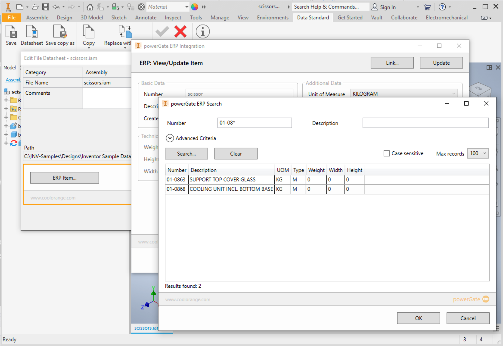
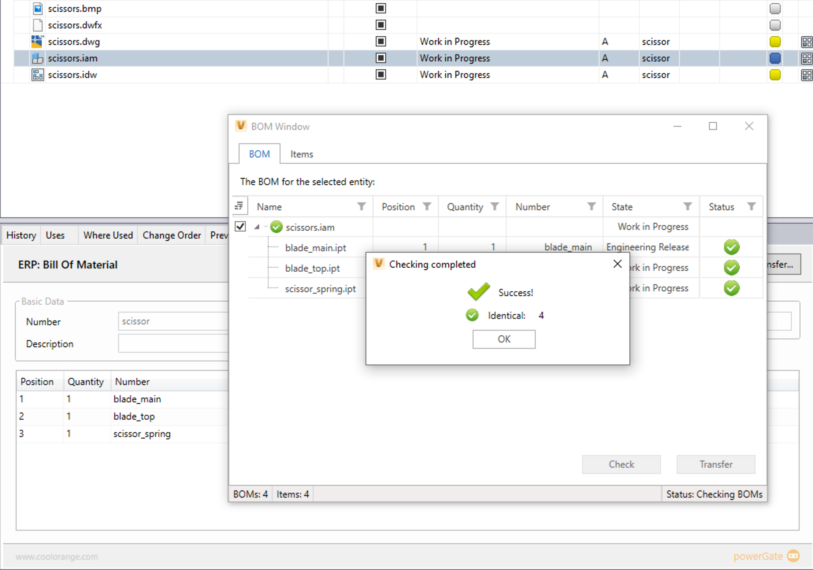

[To the Wiki](./wiki/_sidebar.md)

# powergate-generic-sample

## Disclaimer

THE SAMPLE CODE ON THIS REPOSITORY IS PROVIDED "AS IS" WITHOUT WARRANTY OF ANY KIND, EITHER EXPRESSED OR IMPLIED, INCLUDING, BUT NOT LIMITED TO, THE IMPLIED WARRANTIES OF MERCHANTABILITY, FITNESS FOR A PARTICULAR PURPOSE, OR NON-INFRINGEMENT.

THE USAGE OF THIS SAMPLE IS AT YOUR OWN RISK AND **THERE IS NO SUPPORT** RELATED TO IT.

## Description

This sample demonstrates an ERP integration for Autodesk Vault Professional/Workgroup and Autodesk Inventor by using the coolOrange products powerGate, powerGate Server, powerJobs and powerEvents. It not only adds live views on ERP data to Vault and Inventor but also improves Vault workflows by resticting state changes when ERP data is incomplete and by creating and uploading PDF files to the ERP system when a Vault file or Vault item is released.

It is highly customizable and at the same time it works out-of-the-box with a built-in mockup-ERP system. However, this sample can be extended to work with any ERP system.

**NOTE: This template is not prepared and supported for Vault/Inventor 2022!**

## Screenshots

## Features

TBD!

## Prerequisites

### Autodesk Software
Autodesk Vault 2021 Professional, Autodesk Inventor 2021 and Autodesk Vault DataStandard for Vault and Inventor needs to be installed.

### coolOrange Software 
coolOrange powerGate, coolOrange powerGate Server, coolOrange powerJobs and coolOrange powerEvents needs to be installed.  
coolOrange software can be obtained from the [coolOrange Download Portal](https://download.coolorange.com)

## Installation
Install the latest version from the repository [Releases](https://github.com/coolOrangeLabs/powerGateTemplate/releases/latest) page. The following installers are available: 

### powerGate Server plugin
This setup contains a powerGate Server plugin. It needs to be installed on the machine that hosts coolOrange powerGate Server.

### Vault DataStandard customizations & powerEvents
This setup contains Autodesk Vault DataStandard customizations and coolOrange powerEvents workflow enhancements. It needs to be installed on all Vault client machines. Autodesk Vault DataStandard and coolOrange powerEvents are required on these machines, too.

### powerJobs
This setup contains powerJobs jobs. It needs to be installed on the machine that hosts a Autodesk Vault JobProcessor and coolOrange powerJobs.

## Usage

The script located [createGithubRepository.ps1](https://github.com/coolOrangeProjects/PowerShell.Extensions/tree/master/Others/Automated%20Repository%20Creation) allows a dynamic creation of a new repository in `https://www.github.com/`. The repository copies source code, issues, labels, projects, cards and wiki from this template.

Detailed information on which componentes are taken to the new repo:
- All projects with state `closed` and their cards
- All issues with the label `automation` and state `closed`
  - {REPO_OWNER} is replaced with the Github organization
  - {REPO_NAME} is replaced with the Github repository name 
- All wiki files (the string {REPO_NAME} and {YEAR} will be overwritten with the input from the script)
- labes are taken from the `labels.csv` which is located as a hidden file in the wiki. Can be modified by cloning wiki locally, changing contents and pushing again to this repo.

Run the script as administrator.
Information on how to execute the script can be found when executing `Get-Help .\createGithubRepository.ps1 -full`

## Product Documentation

[coolOrange powerGate](https://www.coolorange.com/wiki/doku.php?id=powergate)  
[coolOrange powerGate Server](https://www.coolorange.com/wiki/doku.php?id=powergateserver)  
[coolOrange powerJobs Processor](https://www.coolorange.com/wiki/doku.php?id=powerjobs)  
[coolOrange powerEvents](https://www.coolorange.com/wiki/doku.php?id=powerevents)

## Author
coolOrange s.r.l.  

